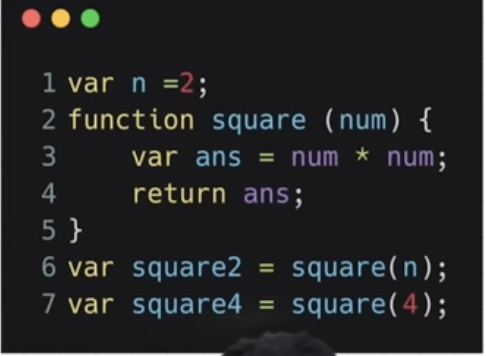
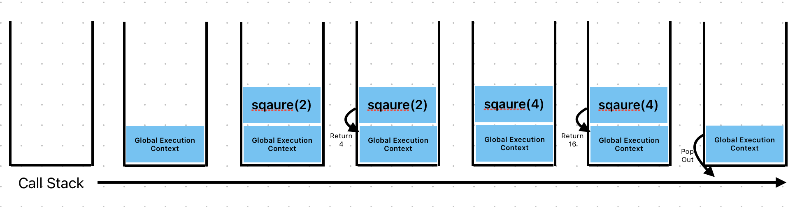

# Namaste JS - Learning JS Basics

15 April 2024

## How Js Works ?

- Everthing in Js happens inside an **Execution Context**.
- Execution Context has two components - Memory (Variable Environment) and Code(Thread of Execution).
- Memory : all values are stored in key value pairs inside memory. It stores variable, objects as well as Functions.
- Code : In this part, the code is executed line by line.
- JS is a `synchronous single threaded language`.
- `Single` - one statement at a time, `synchronous` - Code is executed in a order.

## What happens when you run JS code ?

- When a Js code is executed it creates a execution context.

  

- First Phase : It will allocate memory to all variable and functions.
  | Keyword | value |  
  | ------- | --- |
  | n | undefined |
  | square | whole code {....}|
  | square2 | undefined |
  | square4| undefined |
- Second Phase :
  - `var n = 2;` : n value is changed from undefined to 2 in memory.
  - Line 2 to 5 : nothing to execute.
  - `var square2 = square(n);`: square function is invoked, it created a new context execution inside code segment which has two components memory and code.
    - Memory creation Phase(first Phase) :
      | Keyword | value |  
      | ------- | --- |
      | num | undefined |
      | ans | undefined|
    - Code Execution(Second Phase) :
      - `num` : parameter of the function is intialized using argument passed to the function first.So num changed from `undefined` to `2`.
      - `var ans = num * num` : first num \* num is solved to 4 and then changed the memory of ans from undefined to 4.
      - `return ans;` : return the control to last execution context where that function was invoked.
    - Now the value of `square2` is changed from undefined to 4.
    - And the new context is deleted.
  - `var square4 = square(4);`: Same as before
    > Note : argument is the value which is passed during invokation of a function and paramter which accepts the argument in the function defination.
- The Global context is deleted after that.
- `Call stack` : A call stack is populated with the global execution context whenever a JS code starts executing.
  - After that whenever a new function is invoked a new execution context is pushed inside the call stack
  - And when function return it pops out of the stack and control goes back to the top context inside the stack.
    
  - Call stack maintains the **order of execution** of execution contexts.
  - It is also know as - Executin context stack, Program stack, control stack, runtime stack, machine stack.

## Hoisting in JS
